# Introduction to Intelligent Systems
* 2019년 경북대학교 여름계절학기 지능시스템개론 강의를 듣고 정리하였습니다.
* 기계학습의 기초적인 수학 이론을 공부하고, 이를 python으로 구현해봅니다.
* `tensorflow`, `pytorch` 등의 딥러닝 라이브러리를 사용하지 않고,  `numpy`, `matplotlib.pyplot` 모듈만을 사용해 모든 것을 구현하는 것을 목표로 합니다.

## Lab1 : Non-Regularized Linear Regression
### TODO
* Batch Gradient Descent
* Stochastic Gradient Descent
* Closed-form solution (Ordinary Least Square)
### Linear Regression
#### Hypothesis Function
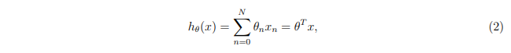
#### Definition of Problem : Cost Minimization
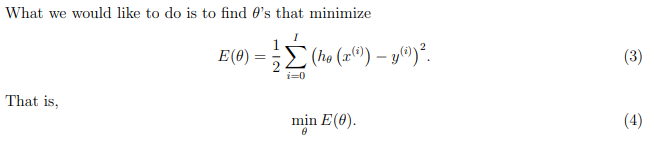
#### Batch Gradient Descent
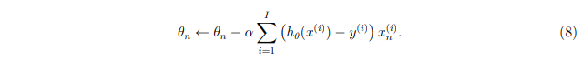
#### Stochastic Gradient Descent
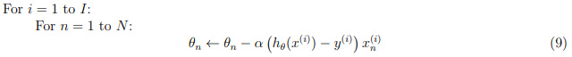
#### Closed-form Solution (Ordinary Least Square)
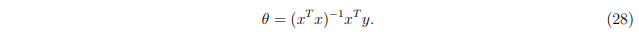

 

## Lab2 : Regularized Regression
### TODO
* Compute and compare solutions for
  1. unregularized linear
  2. unregularized parabolic
  3. unregularized 5th-order polynomial
  4. regularized 5th-order polynomial (RIDGE)
### RIDGE and LASSO
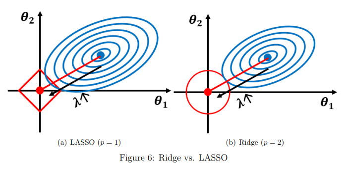
#### Problem definition of Regularized Regression
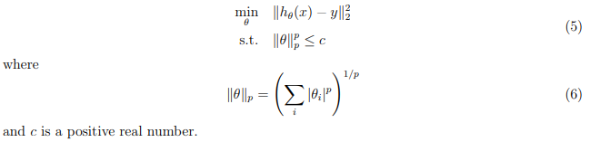
#### Unconstrained version of Problem
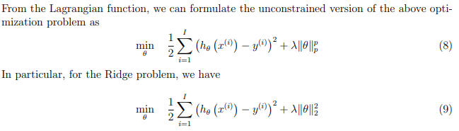
#### Closed-form Solutoin of RIDGE Problem
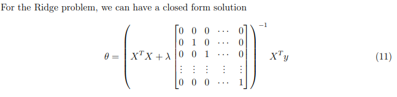

 

## Lab 3 : Feed Forward Neural Network
### TODO
* Implementing FFNN for classification problem
* Back Propagation with Gradient Descent
### About Training
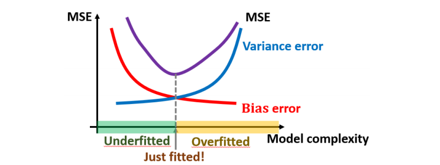
### Model of 2-Layered FFNN
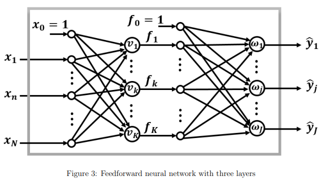
### Gradient Descent of 2-Layered FFNN
#### Update Rule of FFNN
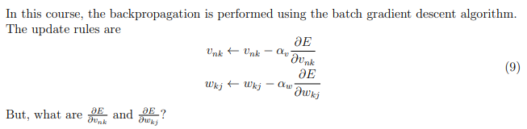
#### Gradient of W
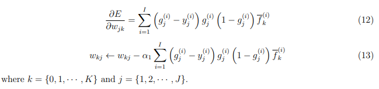
#### Gradient of V
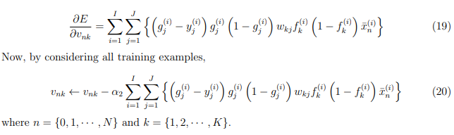

 

## Lab 4 : Feed Back Neural Network (Recurrent Neural Network)
### TODO
* Back Propagation
* Resilient Propagation
* Gradient Clipping
### Elman Model of RNN
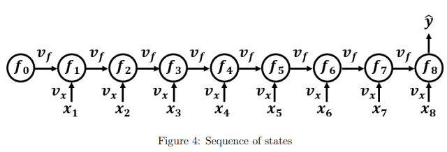
### Gradient Descent of RNN
#### Update Rule of RNN
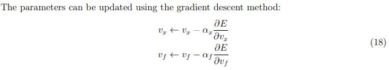
#### Gradient of Vx
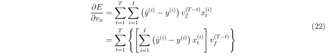
#### Gradient of Vf
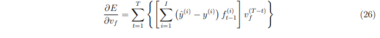
### Issue : Gradient Vanishing / Explosion
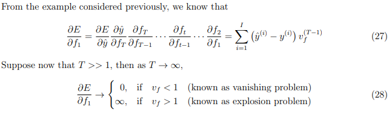
#### Resilient Propagation : accelerate / slow down steps
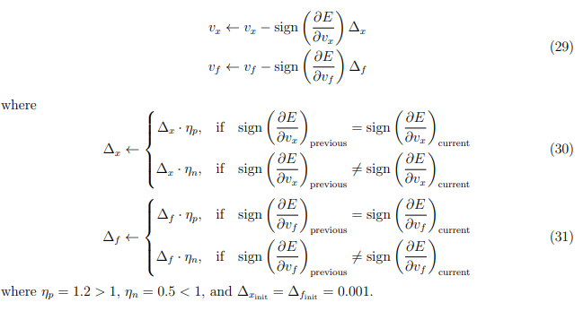
#### Gradient Clipping : Prevent Explosion
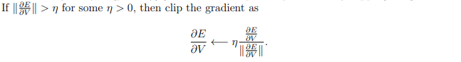

 

## Lab5 : Unsupervised Learning : K-means & PCA
### TODO
* K-means
* PCA
### K-means
#### Difference of Classification and Clustering
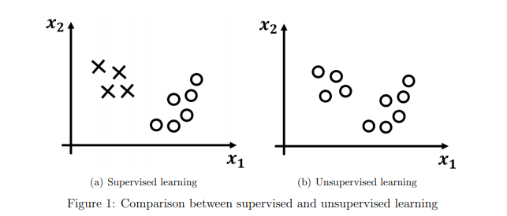
#### Algorithm for K-means
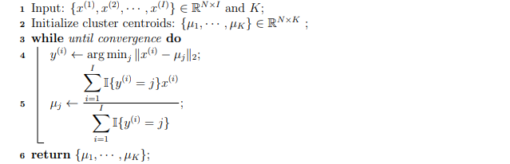
### PCA
#### What is 'Principal Component'
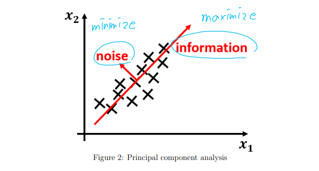
#### Algorithm for PCA
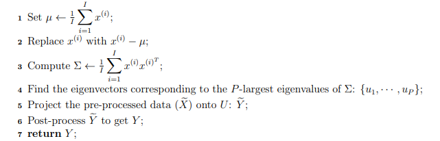

 

## Lab7 : Generative Model : Naive Bayes
### TODO
* Spam Mail Detector with Naive Bayes Classifier
### Discriminitive model and Generative model
* Discriminative model 
  * learns the conditional probability distribution `p(y|x)`
  * learns `p(y|x)` directly from the data and then try to classify data
  * generally give better performance in classification tasks
* Generative model 
  * learns the joint probability distribution `p(x, y)`
  * learns `p(x, y)` which can be transformed into p(y|x) later to classify the data
  * we can use `p(x, y)` to generate new data similar to existing data

### Naive Bayes Classifier
#### Prediction Criterion
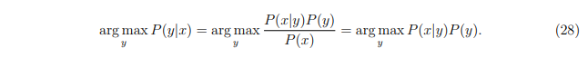
#### Model Parameters
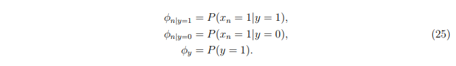
#### Principle of the Maximum Likelihood Estimation (MLE)
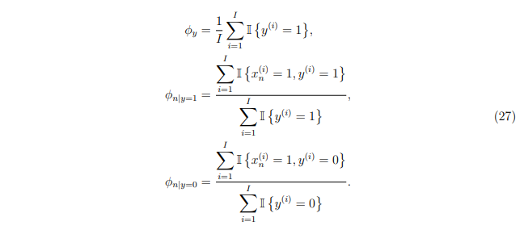
#### Issue : divide by zero
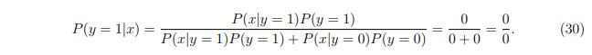
#### Laplace Smoothing : kind of regularization
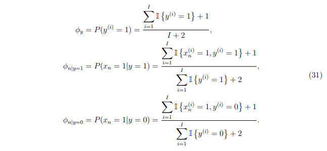
  
